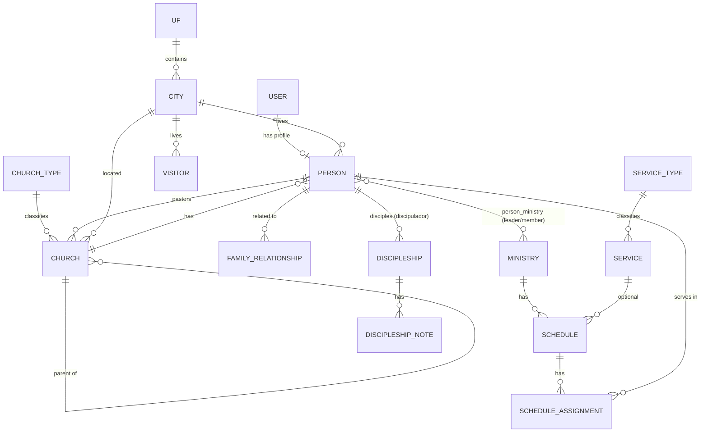

# M7 Church

**Church management system** for congregations and their branch churches: members, visitors, ministries, service schedules and discipleship, all in one place.

Built with Laravel 12, Blade, Livewire and Flux. The interface is in Brazilian Portuguese (`pt_BR`).


---

## Table of contents

- [Features](#features)
- [Tech stack](#tech-stack)
- [Getting started](#getting-started)
- [Roles and permissions](#roles-and-permissions)
- [Domain model](#domain-model)
- [Project structure](#project-structure)
- [REST API](#rest-api)
- [Running tests](#running-tests)
- [Deployment](#deployment)
- [Contributing](#contributing)

---

## Features

### Churches
- Register churches with address, phone, email, logo and senior pastor.
- Classify churches by **church type** and organize them in a hierarchy (headquarters → branch churches).
- Brazilian states (UF) and cities are seeded, with cascading state → city selectors.

### Members (people)
- Full member profiles: personal data, contact info, address, education, profession, photo, baptism and membership dates.
- **Family relationships** (spouse, parents, children) linking members to each other.
- Live search and active/inactive filter (Livewire).
- **Excel export** of the member list.
- **Printable** member record and a blank registration form for paper sign-ups.
- Every user can view and edit their own profile at `/my-profile`.

### Visitors
- Track first-time visitors with visit date, contact info and consent to receive messages.
- Live search and date range filter (Livewire).
- Excel export and a printable blank visitor form.

### Services (worship meetings)
- Define **service types** and recurring services with day of week and time.
- Public page listing the church's regular meetings at `/reunioes`.

### Ministries
- Create ministries with description and logo.
- Assign people as **leaders** or **members**, each with an optional function (e.g. "vocals", "sound").
- Public page listing ministries at `/ministerios`.

### Ministry schedules
- Leaders build **duty rosters** linked to a service or to a custom event title.
- Interactive **monthly calendar** (Livewire): browse months, open a date, add or remove people and delete schedules without a page reload.

### Discipleship
- A dedicated module (backed by the built-in *Discipulado* ministry) to pair a **discipler** with a **disciple**.
- Track status, start and end dates.
- Keep a timeline of **notes** for each discipleship (soft-deleted, so nothing is lost by accident).
- Privacy by default: disciplers only see the discipleships they lead.

### Administration
- Role-based access control with 7 roles (see [Roles and permissions](#roles-and-permissions)).
- **Impersonation**: admins can sign in as another user to troubleshoot what they see.
- Dashboard with totals for members, visitors and services.
- User settings for profile, password and appearance (light/dark).

---

## Tech stack

| Layer | Technology |
|---|---|
| Backend | PHP 8.2+, [Laravel 12](https://laravel.com) |
| Views | Blade templates + [Livewire 3](https://livewire.laravel.com) components ([Volt](https://livewire.laravel.com/docs/volt) for auth and settings) |
| UI components | [Flux](https://fluxui.dev) |
| Styling | [Tailwind CSS 4](https://tailwindcss.com) |
| Client-side | [Alpine.js](https://alpinejs.dev) (with `@alpinejs/mask` for input masks), [SweetAlert2](https://sweetalert2.github.io) |
| Build | [Vite 6](https://vitejs.dev) |
| Database | MySQL |
| Authorization | [spatie/laravel-permission](https://spatie.be/docs/laravel-permission) |
| API auth | [Laravel Sanctum](https://laravel.com/docs/sanctum) |
| Exports | [Laravel Excel](https://laravel-excel.com) (`maatwebsite/excel`) |
| Impersonation | [lab404/laravel-impersonate](https://github.com/404labfr/laravel-impersonate) |
| Debugging | [Laravel Telescope](https://laravel.com/docs/telescope) (local only) |

---

## Getting started

### Prerequisites

- PHP **8.2+** with the usual Laravel extensions (`pdo_mysql`, `mbstring`, `openssl`, `gd`, `zip`, …)
- Composer 2
- Node.js **18+** and npm
- MySQL 8 (or MariaDB 10.6+)

### Installation

```bash
# 1. Clone the repository
git clone https://github.com/martinidavid7/m7church.git
cd m7church

# 2. Install PHP and JavaScript dependencies
composer install
npm install

# 3. Create your environment file and app key
cp .env.example .env
php artisan key:generate
```

### Configure the environment

Edit `.env` and set at least the following:

```dotenv
APP_NAME="M7 Church"
APP_URL=http://localhost:8000
APP_LOCALE=pt_BR
APP_FALLBACK_LOCALE=pt_BR
APP_FAKER_LOCALE=pt_BR

DB_CONNECTION=mysql
DB_HOST=127.0.0.1
DB_PORT=3306
DB_DATABASE=m7church
DB_USERNAME=root
DB_PASSWORD=

# Initial administrator created by the seeder (optional, defaults shown)
ADMIN_NAME="Administrador"
ADMIN_EMAIL=admin@m7church.com
ADMIN_PASSWORD=admin123
```

> **Note:** `.env.example` still has Laravel's SQLite default. The project is developed and run on MySQL, so that is the recommended setup.

### Set up the database

```bash
php artisan migrate --seed
```

The seeders create:

| Seeder | What it does |
|---|---|
| `AdminUserSeeder` | Creates the admin user (from `ADMIN_*` env vars) with the `Admin` role and a linked person record |
| `ChurchTypeSeeder` | Default church types |
| `UfSeeder` / `CitiesSeeder` | Brazilian states and cities |
| `RoleSeeder` | The 7 application roles |
| `ServiceTypeSeeder` | Default service types |

A migration also creates the **Discipulado** ministry that the discipleship module needs.

> ⚠️ **Change the admin password right after your first login.**

### Link the storage folder

```bash
php artisan storage:link
```

### Run the app

A single command starts the web server, the queue worker and the Vite dev server:

```bash
composer dev
```

Then open <http://localhost:8000> and sign in with the admin credentials.

Prefer running them separately? Use three terminals:

```bash
php artisan serve
php artisan queue:listen --tries=1
npm run dev
```

---

## Roles and permissions

Roles are managed with `spatie/laravel-permission`. Any signed-in user with no role automatically gets **Membro** (through the `EnsureUserHasRole` middleware).

| Role | Churches | Members, visitors, cities, services | Ministries & discipleship | Impersonate |
|---|:---:|:---:|:---:|:---:|
| **Admin** | ✅ | ✅ | ✅ all | ✅ |
| **Pastor Presidente** | ✅ | ✅ | ✅ all | — |
| **Pastor Auxiliar** | — | ✅ | ✅ all | — |
| **Secretaria** | — | ✅ | ✅ all | — |
| **Lider de Ministerio**, **Diaconos**, **Membro** | — | own profile only | through ministry links (below) | — |

Outside the staff roles, access to a ministry comes from how the person is linked to it on `person_ministry`, not from their role:

- **Leader** (`role = lider`): can edit the ministry and manage its schedules.
- **Member** (`role = membro`): can view the ministry and its schedules.

The discipleship module follows the same rules through the *Discipulado* ministry. Outside staff, disciplers only see the discipleships they lead.

These rules live in the controller traits under [`app/Http/Controllers/Concerns`](app/Http/Controllers/Concerns):
[`AuthorizesMinistryAccess`](app/Http/Controllers/Concerns/AuthorizesMinistryAccess.php) and
[`AuthorizesDiscipulado`](app/Http/Controllers/Concerns/AuthorizesDiscipulado.php).

---

## Domain model



| Model | Description |
|---|---|
| `User` | Login account. Can be deactivated (`active`). |
| `Person` | Church member profile, optionally linked to a `User`. |
| `FamilyRelationship` | Links two people (spouse, parent, child). |
| `Church` / `ChurchType` | Churches, their type and parent church. |
| `UF` / `City` | Brazilian states and cities. |
| `Visitor` | People visiting the church. |
| `ServiceType` / `Service` | Kinds of meetings and recurring services (day and time). |
| `Ministry` | Ministries, with people attached as leaders or members. |
| `Schedule` / `ScheduleAssignment` | Duty rosters of a ministry and who serves on each date. |
| `Discipleship` / `DiscipleshipNote` | Discipler ↔ disciple pairings and their notes. |

---

## Project structure

```text
app/
├── Exports/                 # Excel exports (members, visitors)
├── Http/
│   ├── Controllers/         # Web controllers (Blade views)
│   │   ├── Api/             # REST API controllers
│   │   ├── Auth/            # API login/logout
│   │   └── Concerns/        # Authorization traits (ministries, discipleship)
│   └── Middleware/          # EnsureUserHasRole
├── Livewire/                # Interactive components (filters, schedule calendar)
├── Models/
└── Providers/
database/
├── migrations/
└── seeders/
resources/
├── css/app.css              # Tailwind entry point
├── js/app.js                # Alpine.js, SweetAlert2
└── views/
    ├── components/          # Blade components and layouts
    ├── livewire/            # Livewire and Volt views (auth, settings, filters, calendar)
    ├── discipleships/
    ├── ministries/
    ├── public/              # Public pages (services, ministries)
    ├── registrations/       # Church, member and visitor forms
    ├── schedules/
    ├── services/
    └── service_types/
routes/
├── web.php                  # Web routes, grouped by role
├── api.php                  # Sanctum-protected API
└── auth.php                 # Login, registration, password reset
```

---

## REST API

The API uses **Laravel Sanctum** tokens. All routes are prefixed with `/api`.

| Method | Endpoint | Auth | Description |
|---|---|:---:|---|
| `POST` | `/api/login` | — | Authenticate and receive a token |
| `POST` | `/api/logout` | 🔒 | Revoke the current token |
| `GET` | `/api/user` | 🔒 | Return the authenticated user |
| `GET` | `/api/church` | 🔒 | Return church data |

Example:

```bash
curl -X POST http://localhost:8000/api/login \
  -H "Accept: application/json" \
  -d "email=admin@m7church.com" -d "password=admin123"

curl http://localhost:8000/api/user \
  -H "Accept: application/json" \
  -H "Authorization: Bearer <token>"
```

---

## Running tests

```bash
composer test
```

This clears the config cache and runs the PHPUnit suite (`php artisan test`). Tests use the settings in [`phpunit.xml`](phpunit.xml).

Format code with [Laravel Pint](https://laravel.com/docs/pint):

```bash
./vendor/bin/pint
```

---

## Deployment

A typical production deploy:

```bash
composer install --no-dev --optimize-autoloader
npm ci && npm run build

php artisan migrate --force
php artisan storage:link

php artisan config:cache
php artisan route:cache
php artisan view:cache
```

Production checklist:

- Set `APP_ENV=production` and `APP_DEBUG=false`.
- Change the default admin password, or set strong `ADMIN_*` values before seeding.
- Run a queue worker (`php artisan queue:work`) under a process manager such as Supervisor.
- Make sure `storage/`, `bootstrap/cache/` and `public/uploads/` are writable by the web server.
- Telescope is a dev dependency. Keep it disabled in production.
- Health check endpoint: `GET /up`.

---

## Contributing

1. Create a branch from `main`: `git checkout -b feature/my-feature`
2. Commit your changes with clear messages.
3. Run `composer test` and `./vendor/bin/pint` before pushing.
4. Open a pull request against `main`.

---

<p align="center">Made with ❤️ by <strong>Martini Software</strong></p>
